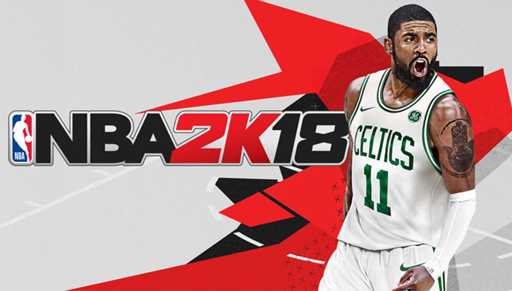
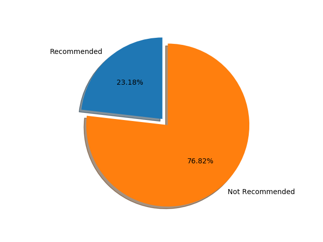

# 2k18 steam reviews
作为个NBA球迷，同时也是2k迷，每年都关注2k系列产品，这是我去年第一买2k系列产品后写的感受。同时写了个简单爬虫对差评统计与分析。  
#### 2k18  
   

作为2K Sports旗下最热门的体育游戏系列新作，在Steam上线的《NBA 2K18》口碑一般，仅仅3天，玩家评价就已跌至“多半差评”。因此写了这个爬虫爬了steam上的差评。  
#### 差评连绵， 吐槽满满  
   

国内玩家们的不满主要集中在网络问题上，许多购买者表示，他们难以联上游戏的服务器。即使联上，也很少能打完1局完整的比赛。这样的问题，其实在游戏的前作中也存在。《NBA 2K17》的许多玩家之前就在评论中表示，他们如果想要正常进行线上游戏的话，就必须另外购买加速器。
除了网络问题外，也有玩家对游戏质量提出了不满。从之前的试玩版就能看出，系列游戏似乎有向RPG游戏靠拢的趋势，特别是在生涯模式部分，而玩家们有关游戏质量的差评，也主要集中在此处。  
#### 推荐度  

   
  评论中76.82%的玩家都是不推荐购买的。   

有玩家表示，生涯模式的许多剧情动画无法跳过，严重影响游戏节奏。也有玩家认为，生涯模式的氪金内容过多，玩家只需要充钱就能变强。至于建模难看，优化过差以及Bug过多这些问题，相较之下似乎也没那么严重了。
总体来说，作为一款主打网络对战的游戏，出现联不上服务器的问题对于《NBA 2K18》而言是极其致命的。虽然玩家联不上厂商服务器问题很复杂，可能不仅仅是因为厂商自己的原因，但我们能看到“FIFA”“PES”等体育游戏近年来的联机体验还是越来越好的。  
